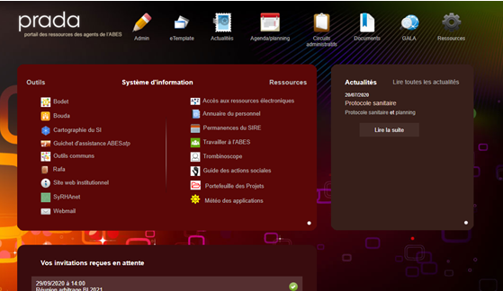
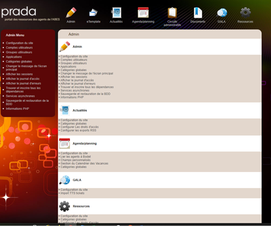

# prada-docker

Configuration docker 🐳 pour déployer l'application Prada de l'Abes.

Prada est une (vielle) application qui héberge l’intranet de l’Abes :
-	Une page d’accueil qui met en avant des pointeurs vers d’autres applications (bodet, bouda, urbanisation, …)
-	Le calendrier des agents de l’Abes (couplé à Bodet)
-	Les circuits administratifs (demande de formation, mission etc …)
-	Le système de ticket interne Gala



Le code source (non opensource car vieux code) de Prada est accessible ici : https://git.abes.fr/depots/prada/

## URLs de l'application

Les URL de prada sont les suivantes :
- https://intranet.abes.fr : environnement de prod (à noter que https://prada.abes.fr redirige vers cette URL)
- https://intranet-test.abes.fr : environnement de test

## Installation de l'application

Pour installer Prada depuis zéro, un prérequis et de disposer d'un serveur ayant docker (>= 20.10.7) et docker-compose (>= 1.28.5). Ensuite il est nécessaire de dérouler les étapes suivantes :

```bash
cd /opt/pod/
git clone https://github.com/abes-esr/prada-docker/
chmod -R 777 /opt/pod/prada-docker/volumes/* # pour que les conteneurs puissent écrire dans les volumes docker déportés sur le disque local

# récupération du code source de Prada (non ouvert)
# pour qu'il puisse être embarqué dans l'image prada-web
cd /opt/pod/prada-docker/
git clone https://git.abes.fr/depots/prada.git ./images/prada-web/src/

# construction de l'image docker local spécifique de Prada avec le code source local
# (étape facultatif car cette image est automatiquement construite au démarrage si elle ne l'a pas déjà été)
docker-compose build

# indiquez les mots de passes souhaités et les différents paramètres
# en personnalisant le contenu de .env (ex: mot de passes mysql et param smtp)
cp .env-dist .env

# import du dump de la bdd depuis les dernières sauvegardes
docker-compose up -d prada-db
DUMP_PATH=$(ssh sotora ls -dt1 /backup_pool/diplotaxis3-prod/daily.0/racine/opt/pod/prada-docker/volumes/prada-db/dump/daily/db_intranet-2* | head -1)
rsync -rav sotora:$DUMP_PATH .
zcat $(basename $DUMP_PATH) \
  | docker exec -i prada-db bash -c 'PGPASSWORD="$POSTGRES_PASSWORD" psql --username=$POSTGRES_USER $POSTGRES_DB'

# import des pièces jointes Gala/ODM depuis les dernières sauvegardes
rsync -rav sotora:/backup_pool/diplotaxis3-prod/daily.0/racine/opt/pod/prada-docker/volumes/prada-web/files/ \
          ./volumes/prada-web/files/
chmod -R 777 ./volumes/prada-web/files/

```


A noter que pour déployer prada-docker en local, en dev ou en test il faut également lancer cette commande qui aura pour effet de générer un fichier ``docker-compose.override.yml`` qui mettra à disposition les outils adminer et mailhog dans des conteneurs dédiés (cf section plus bas) :
```bash
cd /opt/pod/prada-docker/
echo "version: '3'
services:
  prada-mailhog:
    extends:
      file: docker-compose.mailhog.yml
      service: prada-mailhog
  prada-web:
    extends:
      file: docker-compose.mailhog.yml
      service: prada-web
  prada-db-adminer:
    extends:
      file: docker-compose.adminer.yml
      service: prada-db-adminer
" > docker-compose.override.yml
```

Enfin en local, dev et test, il est nécessaire de paramétrer les URLs de l'application qui sont utilisées dans les emails de notification de ticket Gala ou de notification de création d'invitation, voici comment procéder :
1) Pour modifier les URLs envoyées dans les mails Gala, une fois l'application démarrée, il est nécessaire de se connecter en administrateur à Prada puis de se rendre ici : Admin -> GALA -> Configuration du site -> Configuration -> URL du traqueur
2) Pour modifier les URLs envoyées dans les mails du calendrier, une fois le conteneur ``prada-db`` démarré, il est nécessaire de lancer la commande suivante (ajuster le nom de domaine ``intranet.abes.fr`` à la valeur souhaitée) :
  ```bash
  echo "UPDATE egw_config SET config_value = 'intranet.abes.fr' WHERE config_name = 'hostname' AND config_app = 'phpgwapi';" | docker exec -i prada-db bash -c 'PGPASSWORD="$POSTGRES_PASSWORD" psql --username=$POSTGRES_USER $POSTGRES_DB'
  ```


## Démarrage de l'application

```bash
cd /opt/pod/prada-docker/
docker-compose up -d
```

Prada de test est alors accessible ici :
  - http://127.0.0.1:9080/
  - http://diplotaxis3-test.v202.abes.fr:9080/
  - https://intranet-test.abes.fr/

Mailhog est alors accessible ici :
  - http://127.0.0.1:9025/
  - http://diplotaxis3-test.v202.abes.fr:9025/

Adminer est alors accessible ici :
  - http://127.0.0.1:9081/
  - http://diplotaxis3-test.v202.abes.fr:9081/


## Arrêt, redémarrage et logs de l'application

```bash
cd /opt/pod/prada-docker/

# arrêt
docker-compose stop

# redémarrage
docker-compose restart

# vérifier que l'appli fonctionne au niveau docker
docker-compose ps

#Exemple de retour :
#Name              Command                          State          Ports
#------------------------------------------------------------------------------------------------------
#prada-db          docker-entrypoint.sh postgres    Up             5432/tcp
#prada-db-dumper   /bin/sh -c exec /usr/local ...   Up (healthy)   5432/tcp
#prada-web         /docker-entrypoint.overloa ...   Up             0.0.0.0:9080->80/tcp,:::9080->80/tcp

# consulter les logs
docker-compose logs -f --tail=100
```

## Sauvegarde et restauration de l'application

Les éléments importants à sauvegarder sur le système de fichier sont :
- les pièces jointes Gala, des ODM, et du calendrier dans `volumes/prada-web/files/` :
  - répertoire `tracker/` pour les pj des tickets Gala
  - répertoire `calendar/` pour les pj des rendez-vous
  - répertoire `workflow/` pour les pj des ODM
- Le dump de la base de données qui se situe dans `volumes/prada-db/dump/` et qui est généré automatiquement tous les jours par le conteneur `prada-db-dumper`:
  ```
  volumes/prada-db/dump/
  ├── daily
  │   ├── db_intranet-________-______.sql.gz
  │   └── db_intranet-20210813-140420.sql.gz
  ├── monthly
  │   └── db_intranet-______.sql.gz
  └── weekly
      └── db_intranet-______.sql.gz
  ```


Les chemins volumineux à d'exclure des sauvegardes sont les suivants :
- ``/opt/pod/prada-docker/volumes/prada-db/data/*`` : car il contient les données binaires de la base de données postgresql


Pour restaurer la BDD depuis un dump, on procède comme ci-dessous :
```bash

# restaurer la base de données depuis un dump venant du serveur de sauvegarde
cd /opt/pod/prada-docker/
docker-compose up -d prada-db
DUMP_PATH=$(ssh sotora ls -dt1 /backup_pool/diplotaxis3-prod/daily.0/racine/opt/pod/prada-docker/volumes/prada-db/dump/daily/db_intranet-2* | head -1)
rsync -rav sotora:$DUMP_PATH .
zcat $(basename $DUMP_PATH) \
  | docker exec -i prada-db bash -c 'PGPASSWORD="$POSTGRES_PASSWORD" psql --username=$POSTGRES_USER $POSTGRES_DB'


# restaurer la base de données depuis un dump généré par prada-db-dumper sans passer par le serveur de sauvegarde
cd /opt/prod/prada-docker/
DUMP_PATH=$(ls -dt1 ./volumes/prada-db/dump/daily/db_intranet-2* | head -1)
zcat $DUMP_PATH \
  | docker exec -i prada-db bash -c 'PGPASSWORD="$POSTGRES_PASSWORD" psql --username=$POSTGRES_USER $POSTGRES_DB'
```

Pour restaurer les pièces jointes de Gala ou des ODM depuis les sauvegardes :
```
# import des pièces jointes Gala/ODM depuis les dernières sauvegardes
cd /opt/pod/prada-docker/
rsync -rav sotora:/backup_pool/diplotaxis3-prod/daily.0/racine/opt/pod/prada-docker/volumes/prada-web/files/ \
          ./volumes/prada-web/files/
chmod -R 777 ./volumes/prada-web/files/
```

On peut aussi générer/restaurer des dump de la BDD à la demande comme indiqué ci-dessous :
```bash
# dumper manuellement la base de données
docker exec prada-db bash -c 'PGPASSWORD="$POSTGRES_PASSWORD" pg_dump --clean --username=$POSTGRES_USER $POSTGRES_DB' > dump.sql
# et restaurer avec un dump manuel
cat dump.sql | docker exec -i prada-db bash -c 'PGPASSWORD="$POSTGRES_PASSWORD" psql --username=$POSTGRES_USER $POSTGRES_DB'


# pour dumper avec un dump binaire (très rapide)
docker exec prada-db bash -c 'PGPASSWORD="$POSTGRES_PASSWORD" pg_dump -Fc -Z 9 --username=$POSTGRES_USER $POSTGRES_DB' > db_intranet.dump
# et restaurer avec un dump pour pg_restore (très rapide)
docker exec -i prada-db bash -c 'pg_restore -Fc --clean --host=127.0.0.1 --username=$POSTGRES_USER --dbname=$POSTGRES_DB' < db_intranet.dump
```

## Administration de l'application

Pour administrer Prada, cela se passe par l’interface Web. Un simple navigateur Web permet de réaliser les opérations.  
https://intranet.abes.fr/extranet/admin/index.php (accès interne Abes)
 


Les procédures de référence permettant d’administrer l’application sont disponibles ici (accès interne Abes) :
https://bouda.abes.fr/AppliSupport/Prada/Documentation/PRADA_Procedures_pour_le_maintien_en_conditions_operationnelles.docx

Ces opérations sont réalisées par les responsables de Prada :  
cf http://urbanisation.abes.fr/annuaires/annuaireApps.html (accès interne Abes)


## Architecture

L’application est basée sur le vieux framework PHP egroupeware qui a été forké par des développeurs Abes. Les versions d'egroupeware (egw), de php, d'apache, et de postgresql sont figées dans des conteneurs docker ce qui permet de garentir le bon fonctionnement de Prada indépendement de la version du système d'exploitation hote.

L'application est répartie sur trois conteneurs :
- `prada-web` : le serveur web apache+php 
  - `volumes/prada-web/egw/` : volume où on y retrouve le code source PHP de prada (egroupware)
  - `volumes/prada-web/files/` : volume où on y retrouve les pièces jointes des tickets Gala, des ODM et du calendrier
- `prada-db` : la base de données postgresql de prada
  - `volumes/prada-db/data/` : les données binaires de postgresql
- `prada-db-dumper` : pour le backup journalier de la base de données
  - `volumes/prada-db/dump/` : l'emplacement des fichiers des dumps journaliers


Explications des `docker-compose.*.yml` :
- `docker-compose.yml`: permet de lancer tous les conteneurs vitaux pour faire fonctionner prada (prada-web, prada-db, prada-db-dumper)
- `docker-compose.mailhog.yml` (pour le debug): permet de lancer un serveur SMTP fictif qui va intercepter tous les mails envoyés par l'application et propose une interface pour les visualiser :
  - http://diplotaxis3-test.v202.abes.fr:9025/
  - http://diplotaxis3-prod.v102.abes.fr:9025/
- `docker-compose.adminer.yml` (pour le debug): permet de lancer [Adminer](https://www.adminer.org/) qui est une interface d'administration de base de données. Consultable sur le port 9025 ce qui donne ces URL sur les serveurs de déploiement :
  - http://diplotaxis3-test.v202.abes.fr:9081/
  - http://diplotaxis3-prod.v102.abes.fr:9081/

Schéma d'architecture :
  
([cliquer ici](https://docs.google.com/drawings/d/1HuEx83MctG80V9QDKHGSGNrlyq95Ezi3S1SBqXNMmxo/edit?usp=sharing) pour modifier le schéma)

Voir aussi la cartographie de l’application ici : http://urbanisation.abes.fr/web/866d6ca5/views/85519813.html (accès interne Abes)

